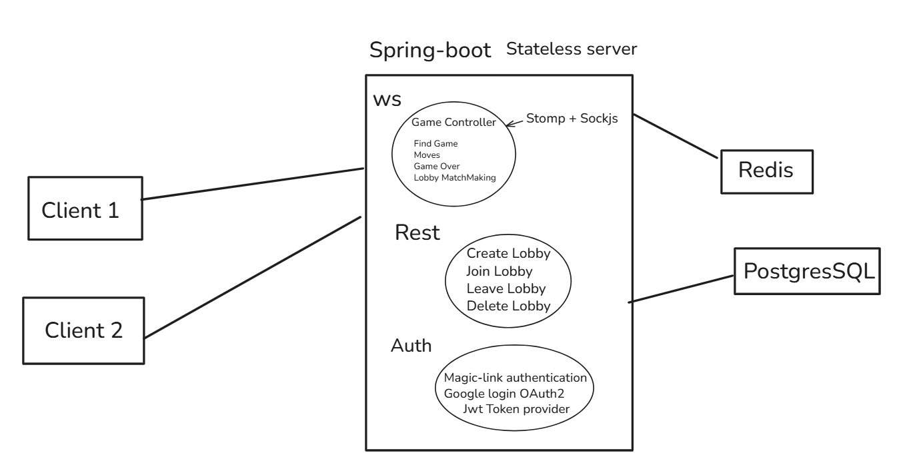

# 🗺️ High-Level Architecture

This project uses a monolithic architecture for real-time multiplayer chess gameplay.

Can be migrated into microservices in the future

Frontend: Vite + React  
Backend: Spring Boot with WebSocket/STOMP  
Data: Redis (live games), PostgreSQL (persistent storage)
